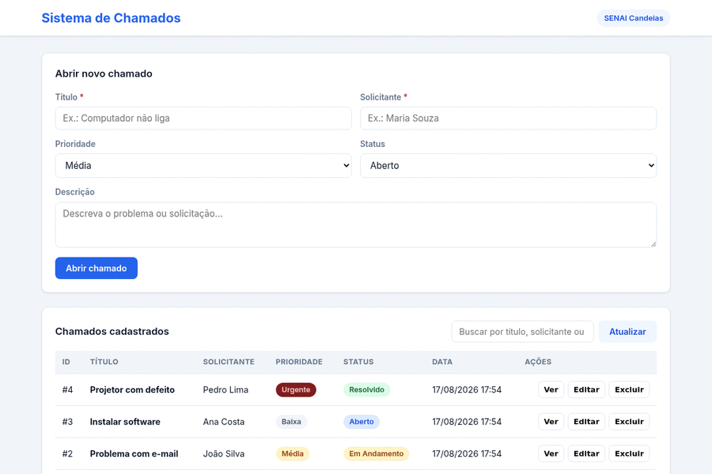

# Sistema de Chamados - Front-End Interativo

> Projeto de continuidade da API REST do **Sistema de Chamados**, agora com interface web responsiva consumindo a API via **Fetch API (JavaScript puro)**.

**Instituição:** SENAI Candeias  
**Professor Orientador:** Adalberto Santana  
**Disciplina / Atividade:** Atividade 04.1 - Front-End Interativo

---

## Demonstração Visual

Interface executando as 4 operações do CRUD (criar, listar, atualizar e excluir chamados):



> **Nota:** Caso o GIF não carregue, a aplicação está disponível ao vivo em: `https://3000-db3f4b81dff3380d.monkeycode-ai.live` (preview desta sessão) — ou rode localmente conforme as instruções abaixo.

---

## Sobre o Projeto

A aplicação permite gerenciar **chamados de suporte técnico** sem a necessidade do Postman. Todo o CRUD é feito pelo navegador:

- **Criar** chamado informando título, solicitante, prioridade, status e descrição
- **Listar** todos os chamados em uma tabela dinâmica com busca em tempo real
- **Atualizar** um chamado (editar formulário ou alterar status diretamente)
- **Excluir** um chamado com confirmação

### Fluxo da Aplicação

```
Navegador (HTML + CSS + JS)
        │  Fetch API (JSON)
        ▼
Back-End (Node.js + Express) ──► Banco de Dados (MySQL)
        │
        └── CRUD: POST / GET / PUT / DELETE /api/chamados
```

---

## Estrutura do Repositório

```
projeto-sistema/
├── backend/
│   ├── config/
│   │   └── db.js              # Conexão com o MySQL (pool de conexões)
│   ├── controllers/
│   │   └── controller.js      # Regras de negócio das operações CRUD
│   ├── routes/
│   │   └── routes.js          # Definição das rotas da API
│   ├── package.json
│   └── server.js              # Servidor Express (API + frontend estático)
├── database/
│   └── script.sql             # Criação do banco + tabela + dados de exemplo
├── frontend/
│   ├── css/
│   │   └── style.css          # Estilos responsivos
│   ├── js/
│   │   └── script.js          # Consumo da API via Fetch API
│   └── index.html             # Página principal
├── postman/
│   └── collection.json        # Collection para testes no Postman
├── docs/
│   └── demo.gif               # Demonstração visual do CRUD
├── docker-compose.yml         # Sobe o MySQL 8 via Docker (opcional)
└── README.md
```

---

## Endpoints da API

| Método | Rota                | Descrição                        |
|--------|---------------------|----------------------------------|
| `POST`   | `/api/chamados`     | Cria um novo chamado             |
| `GET`    | `/api/chamados`     | Lista todos os chamados          |
| `GET`    | `/api/chamados/:id` | Busca um chamado pelo ID         |
| `PUT`    | `/api/chamados/:id` | Atualiza um chamado pelo ID      |
| `DELETE` | `/api/chamados/:id` | Exclui um chamado pelo ID        |

### Campos do chamado

| Campo         | Tipo    | Obrigatório | Observações                                      |
|---------------|---------|:-----------:|--------------------------------------------------|
| `titulo`      | string  |      sim    | Título do chamado (máx. 150 caracteres)          |
| `solicitante` | string  |      sim    | Nome de quem abriu o chamado                     |
| `descricao`   | string  |      não    | Detalhes da solicitação                          |
| `prioridade`  | string  |      não    | `baixa`, `media`, `alta` ou `urgente`            |
| `status`      | string  |      não    | `aberto`, `em_andamento`, `resolvido`, `fechado` |

---

## Como Rodar o Projeto

### Pré-requisitos

- Node.js 18+
- MySQL 8 (ou MariaDB) — pode ser local ou via Docker Compose

### 1. Subir o Banco de Dados

**Opção A - Docker Compose (recomendado):**

```bash
docker compose up -d
```

O script `database/script.sql` é executado automaticamente na primeira subida, criando o banco `sistema_chamados`, a tabela `chamados` e registros de exemplo.

**Opção B - MySQL local:**

```bash
# Configure um banco com usuário/senha
mysql -u root -p < database/script.sql
```

> As credenciais padrão esperadas pelo backend são `root/root` e banco `sistema_chamados`. Caso use outras, ajuste as variáveis de ambiente `DB_HOST`, `DB_USER`, `DB_PASSWORD` e `DB_NAME`.

### 2. Subir o Back-End

```bash
cd backend
npm install
node server.js
```

Saída esperada:

```text
API rodando em http://localhost:3000
```

### 3. Abrir a Interface Visual

Com o servidor rodando, o frontend é servido pelo próprio Node:

- **Navegador:** abra `http://localhost:3000`

> O servidor Express serve a página `frontend/index.html` e, ao mesmo tempo, a API em `/api/*`, eliminando problemas de CORS no desenvolvimento.

### 4. (Opcional) Testar via Postman

1. Importe o arquivo `postman/collection.json` no Postman
2. A variável `base_url` aponta para `http://localhost:3000`

---

## Como Funciona o Front-End

- **`frontend/js/script.js`** usa a **Fetch API** nativa do JavaScript (sem bibliotecas externas) para comunicar com a API
- A interface re-renderiza a tabela automaticamente após cada operação, mostrando os dados persistidos no MySQL
- A busca filtra os chamados em tempo real por título, solicitante ou status
- A interface é **responsiva** (funciona em desktop, tablet e celular)

---

## Licença

MIT - Projeto educacional desenvolvido para a disciplina do SENAI Candeias.
